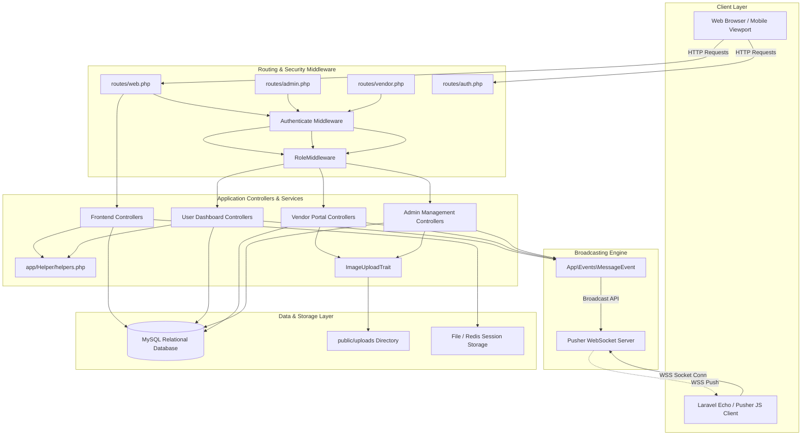
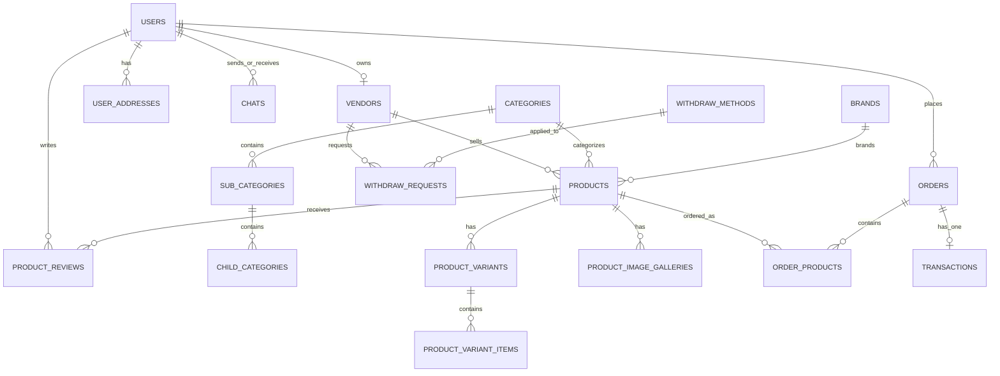
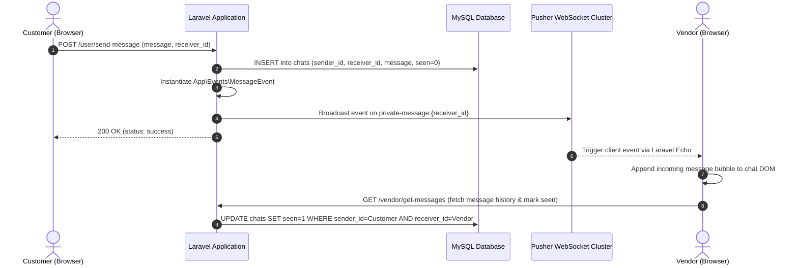
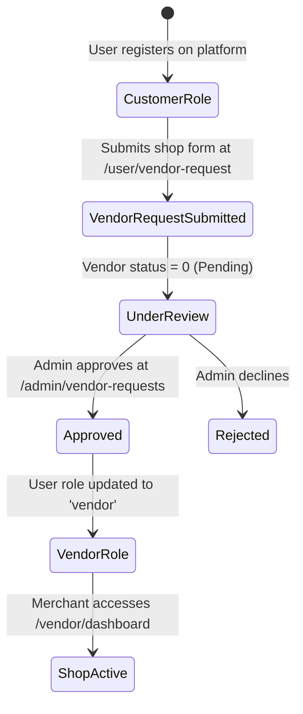
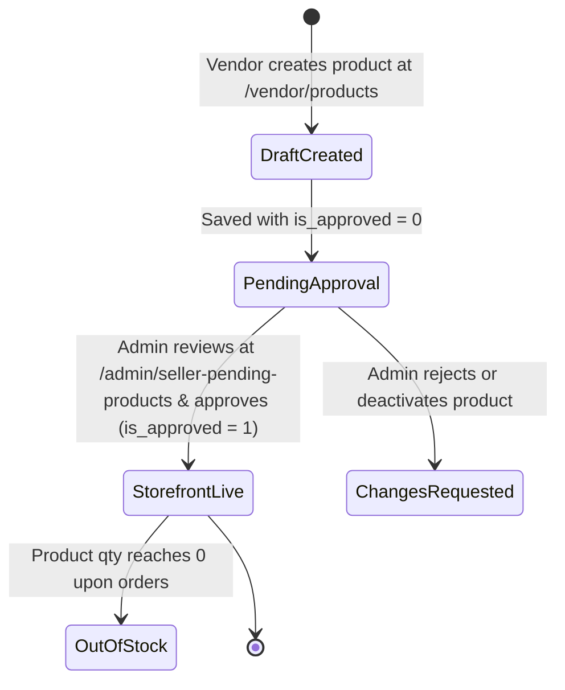
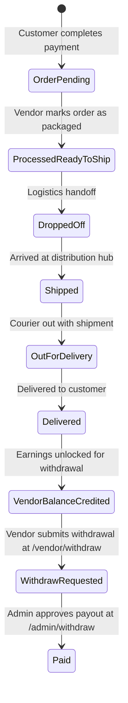

# System Architecture & Technical Design

This document details the architectural principles, domain models, database entity relationships, multi-tenant vendor isolation, security patterns, and real-time event mechanisms powering the Multi-Vendor E-Commerce Platform.

---

## 🏛️ Architectural Principles

The application is engineered using **Laravel 10** following modern MVC principles complemented by domain-driven separation, trait-based code reusability, and event-driven asynchronous communication.

### Key Architectural Tenets:
1. **Multi-Role Tenant Separation**: Distinct authentication boundaries for **Admin**, **Vendor**, and **Customer** roles with zero cross-tenant contamination.
2. **High-Performance Data Retrieval**: Offloading heavy relational data listing, filtering, and searching to 46 **Yajra DataTable** classes using server-side pagination.
3. **Decoupled Real-Time Layer**: Separation of standard HTTP request cycles from real-time customer-merchant interactions using **Pusher WebSockets** and **Laravel Echo**.
4. **Resilient Financial Transactions**: Decoupled order and transaction persistence storing immutable JSON snapshots of addresses, shipping rules, and applied coupon states.

---

## 🗺️ High-Level System Architecture



---

## 🛡️ Multi-Auth & Access Control Model

Authentication is governed by Laravel's built-in session guard combined with `App\Http\Middleware\RoleMiddleware`.

### Role Definition
The `users` table contains a `role` enum/string column:
- `admin`: Super administrator with complete system access.
- `vendor`: Registered merchant authorized to manage their shop, products, variants, and withdrawals.
- `user`: Standard customer accessing storefront, order history, addresses, and wishlist.

### Middleware Implementation: `RoleMiddleware.php`

```php
namespace App\Http\Middleware;

use Closure;
use Illuminate\Http\Request;
use Symfony\Component\HttpFoundation\Response;

class RoleMiddleware
{
    public function handle(Request $request, Closure $next, $role): Response
    {
        if ($request->user()->role !== $role) {
            if ($request->user()->role === 'vendor') {
                return redirect()->route('vendor.dashbaord');
            } elseif ($request->user()->role === 'admin') {
                return redirect()->route('admin.dashbaord');
            } else {
                return redirect()->route('user.dashboard');
            }
        }
        return $next($request);
    }
}
```

### Route RouteServiceProvider Registration
In [app/Providers/RouteServiceProvider.php](file:///d:/old_data/PR/app/app/Providers/RouteServiceProvider.php):
- Admin routes are scoped under prefix `/admin`, name prefix `admin.`, with middlewares `['web', 'auth', 'role:admin']`.
- Vendor routes are scoped under prefix `/vendor`, name prefix `vendor.`, with middlewares `['web', 'auth', 'role:vendor']`.
- Customer routes are defined in `routes/web.php` scoped under prefix `/user`, name prefix `user.`, with middlewares `['auth', 'verified']`.

### Socialite Single Sign-On (SSO)
The platform integrates **Laravel Socialite** supporting 4 OAuth providers:
- **Google** (Scopes: `openid`, `profile`, `email`)
- **GitHub**
- **Facebook**
- **Twitter / X**

The [SocialLoginRegisterController.php](file:///d:/old_data/PR/app/app/Http/Controllers/Auth/SocialLoginRegisterController.php) utilizes `firstOrCreate()` matching user records by email, automatically generating a secure randomized password for new accounts.

---

## 🗄️ Database Architecture & Entity Relationships

The relational database consists of 54 migrations structured into distinct domain clusters:



### Core Domain Models

#### 1. Identity & Vendor Domain
- **`User`**: Core user record storing identity, role (`admin`, `vendor`, `user`), status (`active`, `inactive`), phone, country code, and socialite IDs.
- **`Vendor`**: Linked 1-to-1 to `User`. Stores shop name, banner image, contact email, phone, physical address, description, and status (`0` = pending approval, `1` = approved).
- **`VendorCondition`**: CMS terms and conditions required for merchants before submitting a vendor application.
- **`WithdrawMethod`**: Admin-defined payout channels (e.g. PayPal, Bank Transfer) with minimum/maximum limits and withdrawal fee percentage.
- **`WithdrawRequest`**: Merchant payout requests tracking requested amount, platform charge deducted, net payout, status (`pending`, `paid`, `declined`), and payout account information.

#### 2. Catalog & Inventory Domain
- **`Category`**: Root level product classification with icon and thumbnail image.
- **`SubCategory`**: Second tier taxonomy belongs to `Category`.
- **`ChildCategory`**: Third tier taxonomy belongs to `SubCategory`.
- **`Brand`**: Product manufacturers/brands with logos.
- **`Product`**: Central product record tracking SKU, price, offer price, start/end offer dates, quantity, product type (`new_arrival`, `featured_product`, `top_product`, `best_product`), status, and `is_approved` moderation flag.
- **`ProductVariant`**: Defines attribute groupings (e.g. "Size", "Color").
- **`ProductVariantItem`**: Defines specific options under a variant (e.g. "Small", "XL") with an optional additional price modifier (`price`).
- **`ProductImageGallery`**: Additional high-resolution images for product showcases.

#### 3. Checkout & Financial Domain
- **`Order`**: Master order record containing unique `invocie_id`, total amounts, currency, product quantity, payment method, payment status (`0` = unpaid, `1` = paid), order workflow status, and JSON snapshots:
  - `order_address`: Full shipping and billing snapshot.
  - `shpping_method`: Selected shipping method and fee snapshot.
  - `coupon`: Applied coupon details and computed discount snapshot.
- **`OrderProduct`**: Line item record storing product name, vendor ID, unit price, quantity, and JSON serialized variant selections.
- **`Transaction`**: Records external gateway transaction IDs, payment method, recorded amount in base currency, and real amount in gateway currency.
- **`Coupon`**: Promotional discount rules supporting percentage or fixed discount, usage limits, and validity dates.
- **`ShippingRule`**: Shipping rate policies based on flat fees or minimum order thresholds.

#### 4. Real-Time Chat & Customer Relations
- **`Chat`**: Messaging records between any two users (`sender_id`, `receiver_id`, `message`, `seen` status flag).
- **`PusherSetting`**: UI-manageable Pusher app ID, key, secret, and cluster settings.
- **`NewsletterSubscriber`**: Email subscribers with double opt-in verification tokens (`is_verified`).
- **`Blog`**, **`BlogCategory`**, **`BlogComment`**: Content marketing engine with moderation.

---

## ⚡ Real-Time WebSockets Architecture

Real-time customer-to-merchant and customer-to-admin communication is powered by Pusher.



### Event Definition: `MessageEvent.php`
- Implements `ShouldBroadcast`.
- Broadcasts on `new PrivateChannel('message.' . $this->receiver_id)`.
- Payload (`broadcastWith()`):
  - `message`: Message text.
  - `date_time`: Formatted timestamp.
  - `receiver_id`: Destination user ID.
  - `sender_id`: Originating user ID.
  - `sender_image`: Avatar URL.

### Channel Authorization: `routes/channels.php`
```php
Broadcast::channel('message.{id}', function ($user, $id) {
    return (int) $user->id === (int) $id;
});
```

---

## 📦 Data Presentation Pattern: Yajra DataTables

The platform implements 46 dedicated DataTable classes in `app/DataTables/` to achieve scalable server-side rendering for administrative and merchant lists.

### Architectural Benefits:
- **Server-Side Pagination**: Queries only the exact page slice required (e.g. 10 or 25 rows) regardless of whether the database contains 1,000 or 1,000,000 rows.
- **Dynamic Action Buttons**: Renders toggle switches for instant AJAX status switching (`change-status`) and action dropdowns (Edit, Delete, Manage Variants, Image Gallery).
- **Custom Filtering**: Real-time server-side searching across multi-column joins (e.g. filtering orders by customer name or transaction ID).

---

## 🔄 Core Business Workflows

### 1. Vendor Onboarding & Verification Lifecycle


### 2. Vendor Product Moderation Lifecycle


### 3. Order Processing & Vendor Payout Lifecycle

