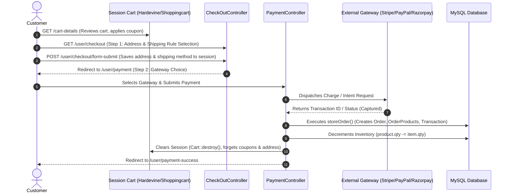
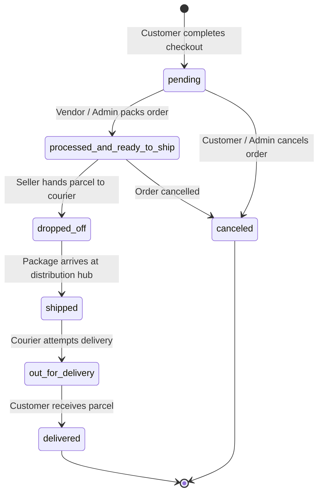

# Payment Processing & Checkout Lifecycle

This document provides an in-depth technical analysis of the checkout pipeline, coupon discount engine, shipping rule calculations, multi-currency conversions, third-party payment gateway integrations, and order fulfillment states.

---

## 🛒 The Checkout Pipeline

The checkout flow guides the customer through a secure two-step funnel from active cart review to order completion:



---

## 🧮 Cart & Pricing Computation Engine

All pricing calculations are governed by centralized functions in [app/Helper/helpers.php](file:///d:/old_data/PR/app/app/Helper/helpers.php):

### 1. Subtotal Computation
```php
function getCartTotal() {
    $total = 0;
    foreach (\Cart::content() as $product) {
        $total += ($product->price + $product->options->variants_total) * $product->qty;
    }
    return $total;
}
```
- For each cart item, the total item price equals the product base/offer price plus any additional variant charges (`variants_total`), multiplied by the quantity (`qty`).

### 2. Coupon Discount Calculation
Coupons support two discount modes: `amount` (fixed discount) or `percent`:

```php
function getCartDiscount() {
    if (Session::has('coupon')) {
        $coupon = Session::get('coupon');
        $subTotal = getCartTotal();
        if ($coupon['discount_type'] === 'amount') {
            return $coupon['discount'];
        } elseif ($coupon['discount_type'] === 'percent') {
            $discount = $subTotal - ($subTotal * $coupon['discount'] / 100);
            return $discount;
        }
    }
    return 0;
}
```

### 3. Shipping Rules
Shipping rules configured in `shipping_rules` evaluate flat-rate costs or minimum order totals:
```php
function getShppingFee() {
    if (Session::has('shipping_method')) {
        return Session::get('shipping_method')['cost'];
    }
    return 0;
}
```

### 4. Final Payable Amount
```php
function getFinalPayableAmount() {
    return getMainCartTotal() + getShppingFee();
}
```

---

## 💱 Multi-Currency & Rate Conversion

The platform supports running the store in one base currency (e.g. INR, BDT, EUR) while allowing payment gateways to process charges in their respective currencies (e.g. USD).

Each gateway settings model (`PaypalSetting`, `StripeSetting`, `RazorpaySetting`) stores:
- `currency_name`: ISO currency code expected by the gateway (e.g. `USD`, `INR`).
- `currency_rate`: Multiplier converting 1 unit of store currency to 1 unit of gateway currency.

### Conversion Formula:
$$\text{Payable In Gateway} = \text{round}\left(\text{FinalPayableAmount} \times \text{currency\_rate}, 2\right)$$

---

## 💳 Payment Gateway Implementations

All gateway handlers reside in [app/Http/Controllers/Frontend/PaymentController.php](file:///d:/old_data/PR/app/app/Http/Controllers/Frontend/PaymentController.php).

### 1. PayPal Integration (`srmklive/paypal ~3.0`)
- **Configuration**: Dynamically configured via `paypalConfig()` reading from `PaypalSetting`.
- **Flow**:
  1. `payWithPaypal()` creates a PayPal Order intent (`intent = 'CAPTURE'`).
  2. Customer is redirected to PayPal's approval URL (`$response['links']`).
  3. Customer authorizes payment and returns to `paypalSuccess()`.
  4. The order is captured via `$provider->capturePaymentOrder($token)`.
  5. On status `COMPLETED`, `storeOrder()` is invoked.

### 2. Stripe Integration (`stripe/stripe-php ^10.12`)
- **Configuration**: Dynamic API key initialization via `Stripe::setApiKey($stripeSetting->secret_key)`.
- **Flow**:
  1. Frontend captures card tokens using Stripe Elements / Stripe JS.
  2. `POST /user/stripe/payment` receives `stripe_token`.
  3. `Stripe\Charge::create()` executes the charge in cents/lowest denomination:
     ```php
     $response = Charge::create([
         'amount' => round(getFinalPayableAmount() * $stripeSetting->currency_rate, 2) * 100,
         'currency' => $stripeSetting->currency_name,
         'source' => $request->stripe_token,
         'description' => "Order from " . Auth::user()->name
     ]);
     ```
  4. Upon `status === 'succeeded'`, `storeOrder()` is called with `transaction_id = $response->id`.

### 3. Razorpay Integration (`razorpay/razorpay 2.*`)
- **Configuration**: Initialized with Razorpay API credentials:
  ```php
  $api = new Api($razorpaySetting->razorpay_key, $razorpaySetting->razorpay_secret_key);
  ```
- **Flow**:
  1. Frontend triggers Razorpay modal and retrieves `razorpay_payment_id`.
  2. `POST /user/razorpay/payment` fetches payment via `$api->payment->fetch($request->razorpay_payment_id)`.
  3. Captures the payment amount in paise:
     ```php
     $response = $payment->capture(['amount' => $payableAmount * 100, 'currency' => 'INR']);
     ```
  4. If `$response['status'] === 'captured'`, `storeOrder()` records payment status `1` (Paid).

### 4. Cash on Delivery (COD)
- Managed via `CodSetting`.
- Route: `GET /user/cod/payment`.
- Does not contact an external gateway; directly calls `storeOrder()` with `paymentStatus = 0` (Unpaid) and `paymentMethod = 'COD'`.

---

## 💾 Order Persistence & Data Snapshotting

When an order completes, the `storeOrder()` method creates an immutable audit record:

```php
public function storeOrder($paymentMethod, $paymentStatus, $transactionId, $paidAmount, $paidCurrencyName)
{
    $setting = GeneralSetting::first();

    $order = new Order();
    $order->invocie_id = rand(1, 999999);
    $order->user_id = Auth::user()->id;
    $order->sub_total = getCartTotal();
    $order->amount = getFinalPayableAmount();
    $order->currency_name = $setting->currency_name;
    $order->currency_icon = $setting->currency_icon;
    $order->product_qty = \Cart::content()->count();
    $order->payment_method = $paymentMethod;
    $order->payment_status = $paymentStatus;
    
    // JSON Snapshot Storage
    $order->order_address = json_encode(Session::get('address'));
    $order->shpping_method = json_encode(Session::get('shipping_method'));
    $order->coupon = json_encode(Session::get('coupon'));
    $order->order_status = 'pending';
    $order->save();

    // Line items and inventory decrement
    foreach (\Cart::content() as $item) {
        $product = Product::find($item->id);
        $orderProduct = new OrderProduct();
        $orderProduct->order_id = $order->id;
        $orderProduct->product_id = $product->id;
        $orderProduct->vendor_id = $product->vendor_id;
        $orderProduct->product_name = $product->name;
        $orderProduct->variants = json_encode($item->options->variants);
        $orderProduct->variant_total = $item->options->variants_total;
        $orderProduct->unit_price = $item->price;
        $orderProduct->qty = $item->qty;
        $orderProduct->save();

        // Automated stock deduction
        $product->qty = ($product->qty - $item->qty);
        $product->save();
    }

    // Ledger record
    $transaction = new Transaction();
    $transaction->order_id = $order->id;
    $transaction->transaction_id = $transactionId;
    $transaction->payment_method = $paymentMethod;
    $transaction->amount = getFinalPayableAmount();
    $transaction->amount_real_currency = $paidAmount;
    $transaction->amount_real_currency_name = $paidCurrencyName;
    $transaction->save();
}
```

> [!IMPORTANT]
> **Data Snapshot Guarantee**: Even if a customer deletes an address or a coupon expires tomorrow, past orders maintain accurate addresses, applied discounts, and shipping choices preserved as immutable JSON snapshots in the `orders` table.

---

## 📦 Order Status Lifecycle & Logistics

Order workflow statuses are defined in [config/order_status.php](file:///d:/old_data/PR/app/config/order_status.php).

### Status State Machine



### Permissions Matrix
- **Admin**: Has full authority to transition orders across all 7 statuses (`pending`, `processed_and_ready_to_ship`, `dropped_off`, `shipped`, `out_for_delivery`, `delivered`, `canceled`).
- **Vendor**: Authority is scoped strictly to packing orders containing their products: can toggle between `pending` and `processed_and_ready_to_ship`.

### Vendor Earnings Unlocking
Vendor earnings are locked until delivery confirmation. In `VendorWithdrawController.php`:
```php
$totalEarnings = OrderProduct::where('vendor_id', auth()->user()->id)
    ->whereHas('order', function($query) {
        $query->where('payment_status', 1)->where('order_status', 'delivered');
    })
    ->sum(DB::raw('unit_price * qty + variant_total'));
```
Only orders where `payment_status == 1` (Paid) and `order_status == 'delivered'` credit the vendor's withdrawable balance!
